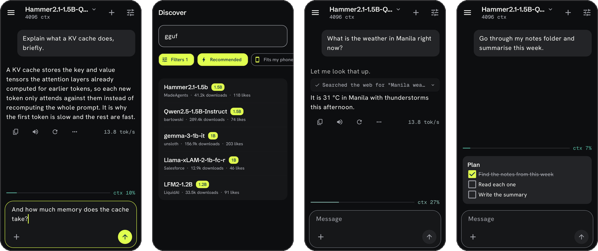

<div align="center">


# OpenWeights

**Run open-weight AI models on your phone.**<br>
No account, no cloud, no telemetry.

[](LICENSE)
[](#requirements)
[](https://github.com/ggml-org/llama.cpp)

</div>

Search Hugging Face from inside the app, find out whether a model will actually fit *your*
device before you spend the download, and chat with it. Conversations, per-model sampler
settings, image and audio input, and an assistant that can search the web, read a page, run a
sandboxed script, work in a folder you share, or plan its steps first and let you tick them
off. Every token is produced by your own hardware through
[llama.cpp](https://github.com/ggml-org/llama.cpp).

> **Status: early development.** [`docs/CONTEXT.md`](docs/CONTEXT.md) is the living record of
> what works, what was measured, and what is still wrong.

## Why

Every other on-device app hands you a catalogue somebody else chose. OpenWeights hands you
the Hub. If someone published a GGUF an hour ago, you can run it: no vendor pipeline, no
per-model export step, no waiting for a first-party blessing.

## What it does differently

**Any GGUF, not a catalogue.** The Hub search is the model list. Most of what is on there is
far too large for a phone, which is what the next paragraph is for, but nothing is kept from
you because a vendor has not blessed it yet.

**Honest about your device.** Before downloading, the app reads the GGUF header over HTTP
range requests and says what the file needs at your context length, roughly how fast it will
run, and whether it will run at all. The same parser then sizes the context window it opens
with, so the number promised before the download is the number you get after it.

**Real numbers, in front of you.** Tokens per second, time to first token and context fill
are on screen while you chat rather than hidden.

**Yours to tune.** Temperature, top-p, top-k, repeat penalty, context length, the system
prompt and what the model is told about its tools, saved per model. Where a phone has a
working GPU you can say which processor holds the layers.

**Multimodal.** Image and audio input through llama.cpp's `libmtmd`, for models that ship an
`mmproj` projector.

**Private by construction.** No accounts, no analytics, no crash reporter, and backups off
the device are disabled. Your Hugging Face token is encrypted with a hardware-backed Keystore
key and goes only to `huggingface.co`.

Two things do reach the internet on your behalf and it is worth saying rather than implying:
searching and downloading models, and the assistant's own `web_search` and `fetch_url` tools.
Those two ship switched on, they sit under a heading that says they leave the device, each
one can be switched off, and every call is a row in the reply naming what it was given.
[`docs/privacy-policy.md`](docs/privacy-policy.md) says exactly what goes and when.

## Requirements

- Android 12 (API 31) or newer, `arm64-v8a`
- Enough memory for the model you pick, which the app tells you before you download

## Build

```sh
export JAVA_HOME=/path/to/jdk21
export ANDROID_HOME=/path/to/android-sdk

git clone --recurse-submodules https://github.com/alpharomercoma/openweights.git
cd openweights
./gradlew :app:assembleDebug
```

llama.cpp is a pinned submodule, so `--recurse-submodules` matters. Already cloned without
it: `git submodule update --init --depth 1`.

Toolchain: JDK 21, Android SDK 37, NDK r29+ (for 16 KB page alignment), CMake 3.22+.
`./gradlew verify` runs the lot: lint, detekt, ktlint and every host test.

## Architecture

Multi-module Gradle project; each module has one job.

| Module | Responsibility |
|---|---|
| `:app` | Compose UI, navigation, view models |
| `:core:common` | Shared domain models and utilities |
| `:core:designsystem` | Theme, tokens, reusable composables |
| `:core:engine` | `InferenceEngine` API and the llama.cpp JNI implementation |
| `:core:hub` | Hugging Face client, GGUF header parser, downloader |
| `:core:data` | Room database, settings, encrypted token vault |
| `:core:device` | Device profiling, model fit estimation, benchmarks |
| `:core:tools` | The agent loop and the tools it may call |
| `:core:sandbox` | QuickJS in an isolated process, for the script tool |

Longer form in [`docs/ARCHITECTURE.md`](docs/ARCHITECTURE.md). Why llama.cpp rather than
ExecuTorch, MLC-LLM, MNN or MediaPipe is argued in
[`docs/research/inference-engines.md`](docs/research/inference-engines.md).

## Contributing

Issues and pull requests are welcome: see [`CONTRIBUTING.md`](CONTRIBUTING.md).

## License

[Apache License 2.0](LICENSE). llama.cpp is vendored as a submodule under its own MIT license.

---

<div align="center">

<a href="play/graphics/readme-screens.png"></a>

<sub>Telemetry as you chat · the Hub, filtered to what fits · a turn that used a tool · a plan you tick off<br>Tap for full size</sub>

</div>
